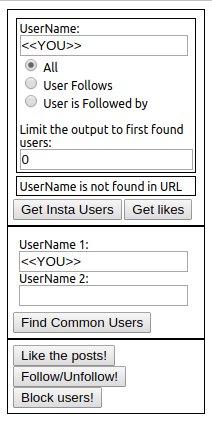
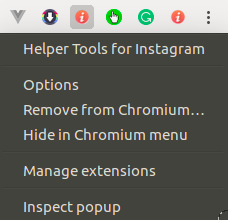
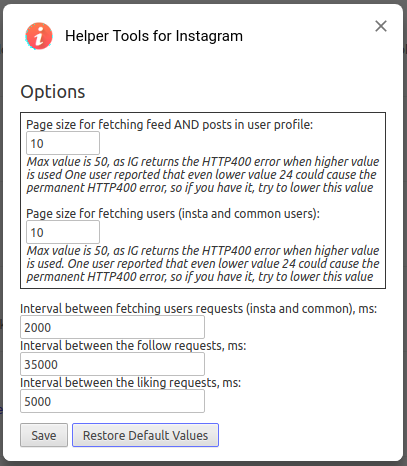

#  [InstagramHelper](https://github.com/OllegK/InstagramHelper)
Free Chrome Extension [Helper Tools for Instagram.com](https://github.com/OllegK/InstagramHelper).

## What the Extension Does
1. Create a list of people following/followers your own or another user's account. If you want to create a list for another user's account, this account should be public, or you should follow it. **You will not be able to create a list for the private account you do not follow.** The created list could be exported to Excel. [Read more here](#create-a-List-of-Following/Followers).
  * When you generated a list of somebody's else followers/following, you can follow all people from the list. Some of them will follow you back. [Read more here](#follow-the-users-from-generated-list).
  * When you generated a list of your followers/following, you can also unfollow all people who don't follow you. There is a way to keep some people - this option is not very comfortable now, and probably it will be improved in future versions. For now, you need to put the IDs of people who should be kept followed in the textarea control; pay attention that it should be precisely numeric ID (not username, as the user can easily change the username, however, ID is not changeable), and each ID should be put on the separate line.  
2. Find the common users between two Instagram accounts.
3. Like the posts in your feed, or in someone's else profile. 
4. Calculate the total amounts of likes in your of someone's else profile, and group them by likers. Try that on your girlfriend's or boyfriend's profile to find her/his secret admirers.
5. Mass follow/unfollow the list of user IDs/usernames.
6. Mass block the list of user IDs/usernames.

## How to start
When you are on Instagram.com, the extension icon is active is enabled in Chrome's toolbar - 

Click on it, and extension's popup applet appears.  

## Create a List of Following/Followers
1. When you are on Instagram.com, click the extension's icon. The extension's popup applet is displayed.

 
2. The extension tries to guess the username from the context, if the username cannot be found, it sets <<YOU>> as username. It means it will generate the list of your followers/following. You can keep it, or you can another username to generate the list of its followers/following. Please remember that **you will not be able to create a list for the private account you do not follow.**  
3. You can also change the scope of the list to be generated. The default value "All" means that the generated list includes followers and following. You can select followers of following only. Also the extension allows to limit the amount of fetched users to Nth first returned users. From my observation, the latest followers/following users are returned in the beginning, therefore limiting the output could be useful to get the latest relationships only. If the value is 0 (default value), the limit is not applied. The limit is applied independently to both relationships: followers and following, it means if limit is 1000, the extension fetches 1000 followers and 1000 following persons when requested relationship is All (followers and following). Therefore the length of created list could be about 2000 users, depending on how much followers and following intersect. Also the setting limit to 1000, doesn't mean that exactly 1000 users will be returned in the output, the total amount of returned users could be a little bit higher depending on the amount of users returned by 1 requests.

4. Click the "Get Insta Users" button. The process starts, just wait for the process to be completed. Please read [below](#How-to-Make-the-Process-Faster) how to make the process faster. The first results are displayed just when all users are fetched from Instagram.com. However these first results are not detailed enough, they only display the username, the small picture of the profile, and several other attributes. The getting the detailed info continues in background, and when it completes, the list with detailed info is displayed.  

### Export the Generate List into Excel
If you have a long list with more than 100k+ accounts, the export could take significant time. During this time the tab is not responsive, and you could assume that the process hangs. Please be patient and just wait, it will be finished successfully. One time I tried the export of 100k+ users, and it took about 30 minutes.

### Follow the Users From Generated List

### How to Make the Process Faster
Change the extension's options. Right click on the extension's icon in Chrome's toolbar, the context menu will be displayed. 

Select the Options item and the Options dialog appears.

The picture above displays the default values, if you have never changed the options, you will have the same values as on this picture.

There are two options that could improve the performance of the process, but adjust them wisely:
1. "Page size for fetching users (insta and common users):". The default value is 10, and the maximum allowed value is 
50. 50 works for me, however some users reported the constant HTTP400 error when the value is increased. Try to increase the value and start the process. If you have the constant HTTP400 error, try to decrease the value and restart the process. 
2. "Interval between fetching users requests (insta and common), ms:". If the value of delay is too small, the Instagram.com can return HTTP429 error (too many requests, try several minutes later). 

The changes will be effective when a new process will start.

Also try to keep the tab active when the process is running, as the Chrome slowes down the JavaScript execution for background tabs.

### Possible issues
The extension is built to handle the different HTTP errors and retry with interval of three minutes. Sometimes one retry is not enough, the error repeats, and the countdown begins again. Please be patient and wait, in the most cases it  disappears sooner or later.

## Links
* [Github](https://github.com/OllegK/InstagramHelper)
* [Web page](https://instascraper.weebly.com/)
* [Extension on Chrome Web Store](https://chrome.google.com/webstore/detail/helper-tools-for-instagra/hcdbfckhdcpepllecbkaaojfgipnpbpb)

## Refresh the inactive tab
When a tab is not active for a long time, the Chrome could refresh it when 

Please try to keep the tab active, it is also described [here](https://superuser.com/questions/1048029/disable-auto-refresh-tabs-in-chrome-desktop#comment1467739_1048029) how to disable this behavior.

## Donations
This extension is free, however if you would like to donate:   
* BTC: 1LtKe6AKDvJ1nhZjPwRBnJe4QovqxhLRjN  
* BCH: 1NgX5ywvuAPTvz6y6tU3kfTvv7NHH8YoKp  
* LTC: LW55k6MD8WBuV8NUxEXBBXeRv3vzzF3tfN  
* ETH: 0x2EB4DB0cA8100E749BDB2D52844A96c86863Ae92  
